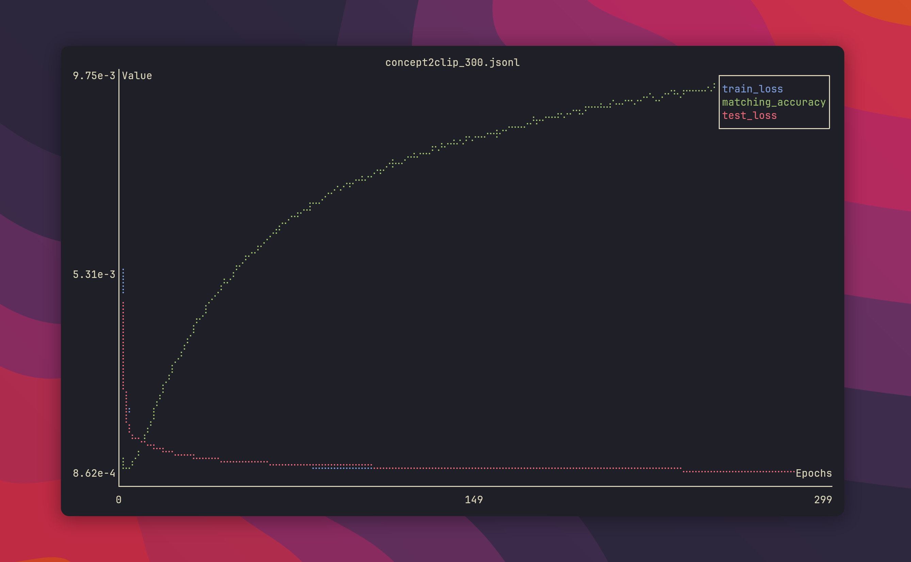

# Plot Monitor

A simple TUI to watch and plot `jsonl` training logs in real time.



Examle usage:

```bash
cargo run -- examples/logs.jsonl
```

## TODO

- [ ] TUI options to update filters live
- [ ] Plotters-rs + GTK backend (GUI mode)
